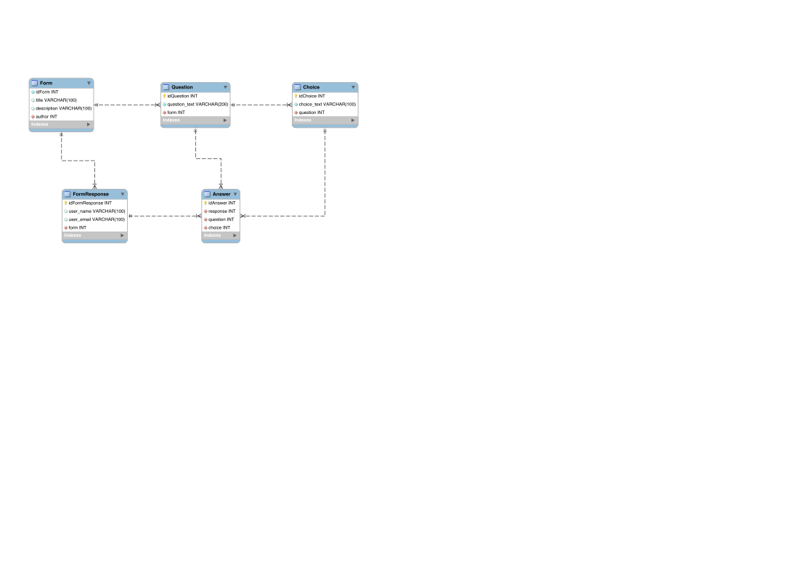

# Survey Homework

## Run the development app

### dependencies

Python>=3
Node>=12

### Steps

```bash
source /bin/activate
pip install -r requirements.txt

cd survey
python manage.py runserver
```

## Docs

### Database


### APIs

#### GET survey_form/api/forms/

get forms list

response:

FormObject[]
```
[
{
id: int,
title: string,
description: string,
questions: QuestionObject[]
}
]
```

#### POST survey_form/api/forms/

create a form

request body:
```
{
title: string,
description: string,
questions: [
  {
    question_text: string,
    choices: [
      {
        choice_text: string
      }
    ]
  }
]
}
```
response:

FormObject
```
{
id: int,
title: string,
description: string,
questions: QuestionObject[]
}
```

#### GET survey_form/api/forms/:id

get details of a form

response:

FormObject
```
{
id: int,
title: string,
description: string,
questions: QuestionObject[]
}
```

#### POST survey_form/api/responses/

create responses for a form

request body:
```
{
form: formId,
user_name: string,
user_email: string,
answers: [
  {
    question: questionId,
    choice: choiceId
  }
]
}
```
response:

FormResponseObject
```
{
id: int,
form: int,
user_name: string,
user_email: string,
answers: [
  {
    id: int,
    question: int,
    choice: int
  }
]
}
```


### Typedefs

#### FormObject
```
{
id: int,
title: string,
description: string,
questions: QuestionObject[]
}
```

#### QuestionObject
```
{
id: int,
question_text: string,
choices: ChoiceObject[]
}
```

#### ChoiceObject
```
{
id: int,
choice_text: string
}
```

### FormResponseObject
```
{
id: int,
form: int,
answers: FormAnswerObject[],
user_name: string,
user_email: string
}
```

### FormAnswerObject
```
{
id: int,
question: int,
choice: int
}
```
